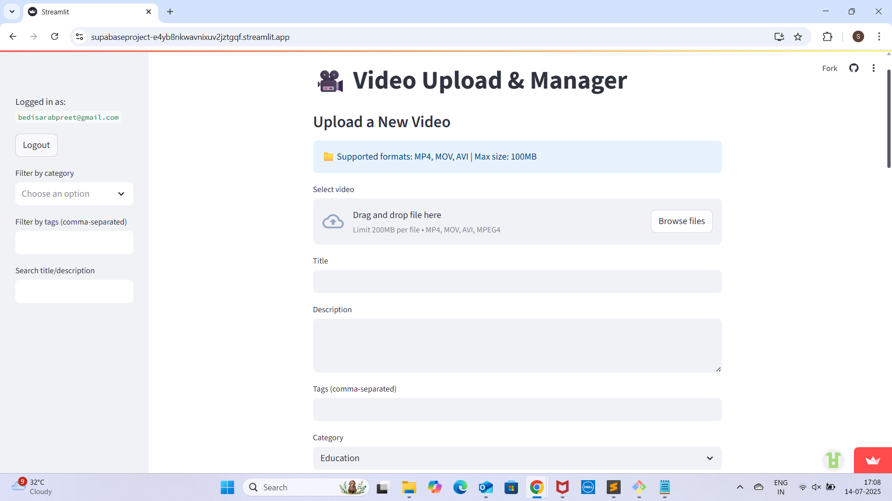
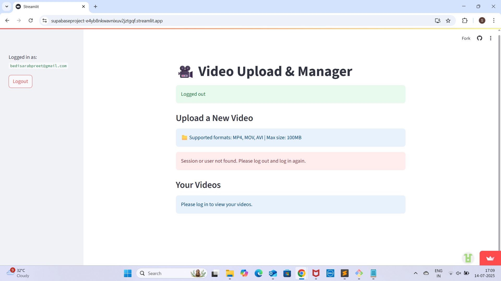
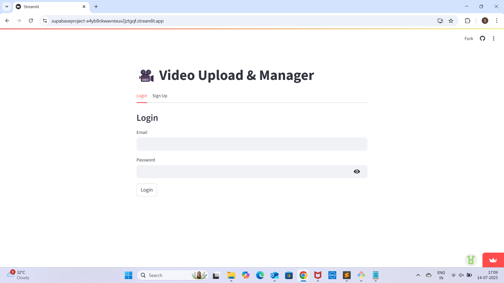
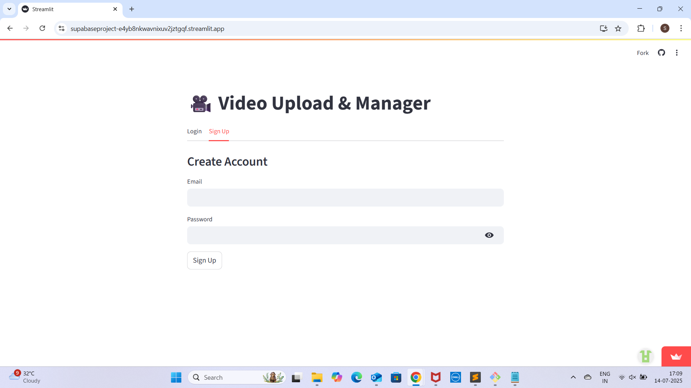

# Project URL

This project is deployed at: [https://supabaseproject-e4yb8nkwavnixuv2jztgqf.streamlit.app/](https://supabaseproject-e4yb8nkwavnixuv2jztgqf.streamlit.app/)

---

# Security, RLS, and User Authentication in This Project

## 1. User Authentication

- **Supabase Auth** is used for user authentication.
  - Users sign up and log in with email and password.
  - Upon login, Supabase issues a **JWT (JSON Web Token)** for the user.
  - The JWT is used to identify the user in all subsequent requests.
- The JWT contains the user’s unique ID (`sub`), email, and other metadata.
- The Streamlit app stores the user and session (including the JWT) in `st.session_state`.

## 2. Row Level Security (RLS) Policies

- **RLS is enabled** on all sensitive tables (e.g., `profiles`, `videos`).
- **Policies are written to ensure users can only access or modify their own data.**
- Example policies:
  - **Profiles Table:**
    - Users can select/update their own profile:
      ```sql
      USING (id = auth.uid())
      ```
  - **Videos Table:**
    - Users can insert/select/update videos where `user_id` matches their JWT’s `sub` claim:
      ```sql
      WITH CHECK (user_id = (current_setting('request.jwt.claim.sub', true))::uuid)
      USING (user_id = (current_setting('request.jwt.claim.sub', true))::uuid)
      ```
    - This ensures only the owner of a video can insert/select/update it.

## 3. IT Security Practices

- **Service Role Key** is used only in trusted backend code (your Streamlit app, not exposed to users).
  - This key bypasses RLS and should never be exposed in frontend/public code.
- **Secrets** (keys) are stored securely in `.streamlit/secrets.toml` or Streamlit Cloud secrets, not in code.
- **No sensitive information is printed or exposed to users.**
- **Unique file names** are generated for uploads to prevent collisions and information leakage.

## 4. Summary Table

| Security Feature         | How It’s Used in This Project                                 |
|-------------------------|---------------------------------------------------------------|
| User Authentication     | Supabase Auth (email/password, JWT)                           |
| RLS                     | Enabled on all sensitive tables, user-specific policies       |
| JWT                     | Used for user identification and RLS enforcement              |
| Service Role Key        | Used only in backend for privileged operations                |
| Secrets Management      | All keys stored in secrets, not in code                       |
| Unique File Names       | Prevents duplicate/guessable uploads                          |

---

**In Short:**
- **Authentication:** Supabase Auth with JWT.
- **Authorization:** RLS policies using `auth.uid()` or `current_setting('request.jwt.claim.sub', true)`.
- **IT Security:** Service role key only in backend, secrets not in code, unique file names, no sensitive info exposed.

  ---

## Supabase Setup Screenshots

| Step  | Screenshot |
|-------|------------|
| 1     |  |
| 2     |  |
| 3     |  |
| 4     |  | 
